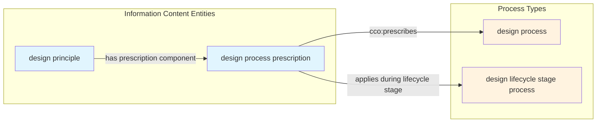
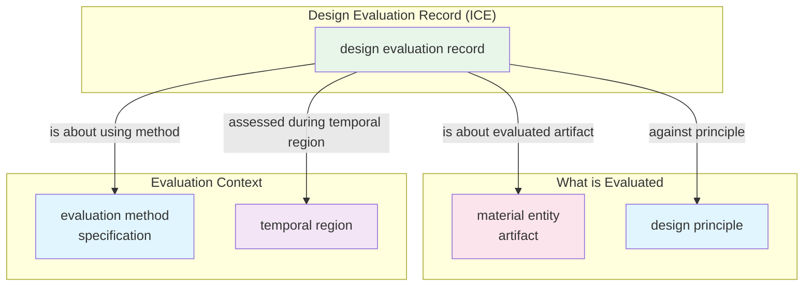
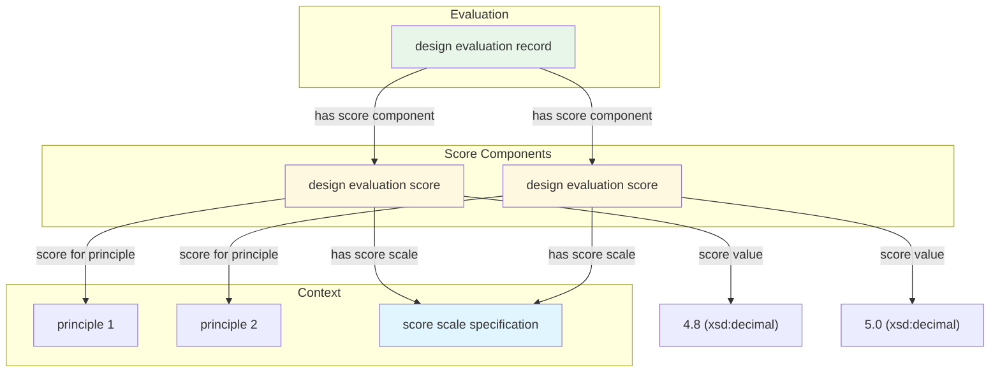
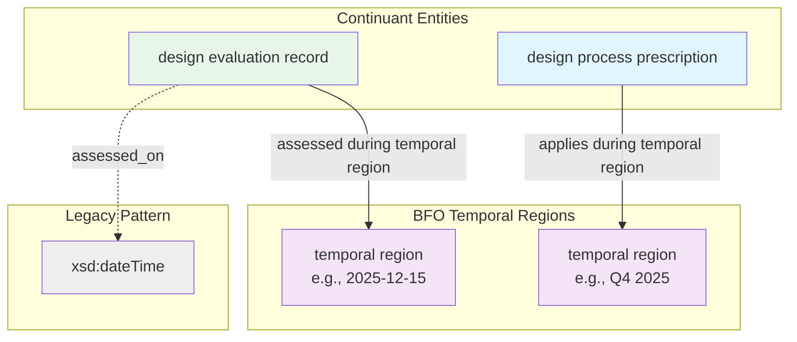
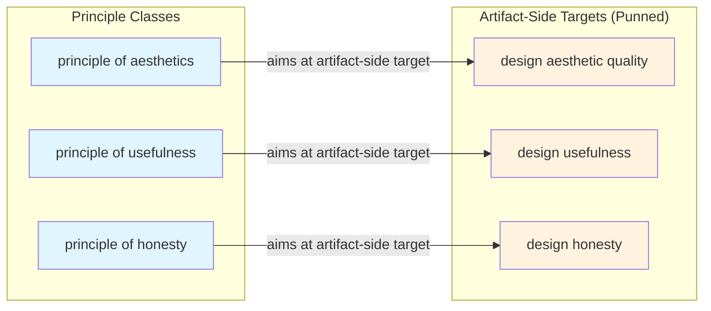
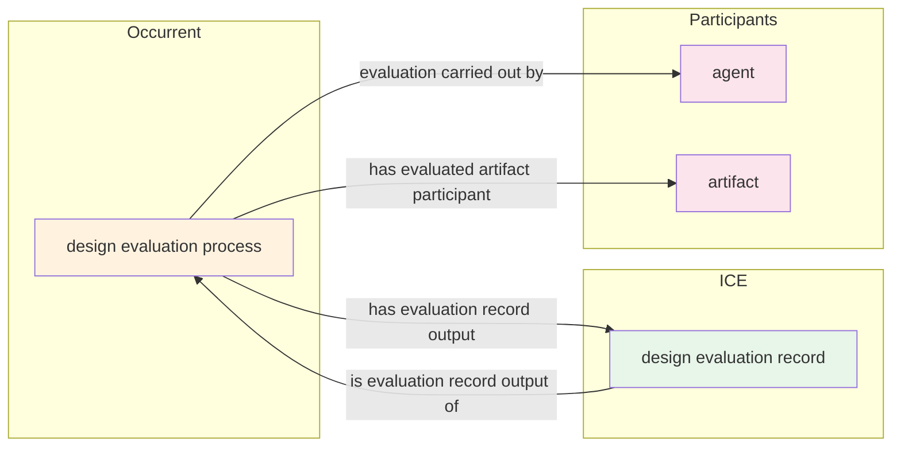
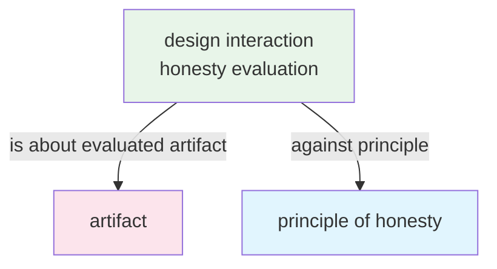
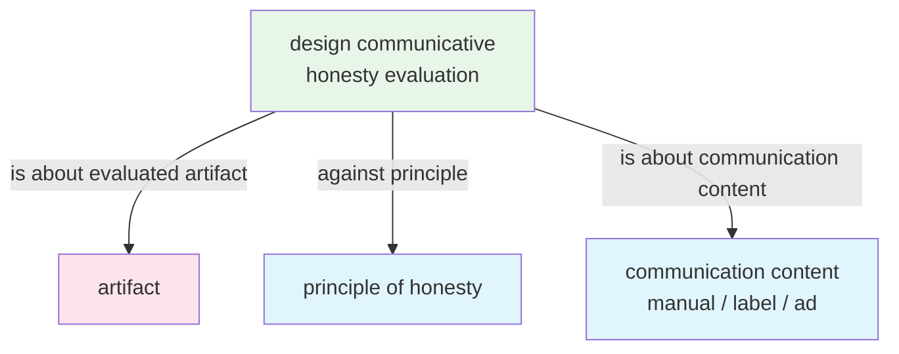
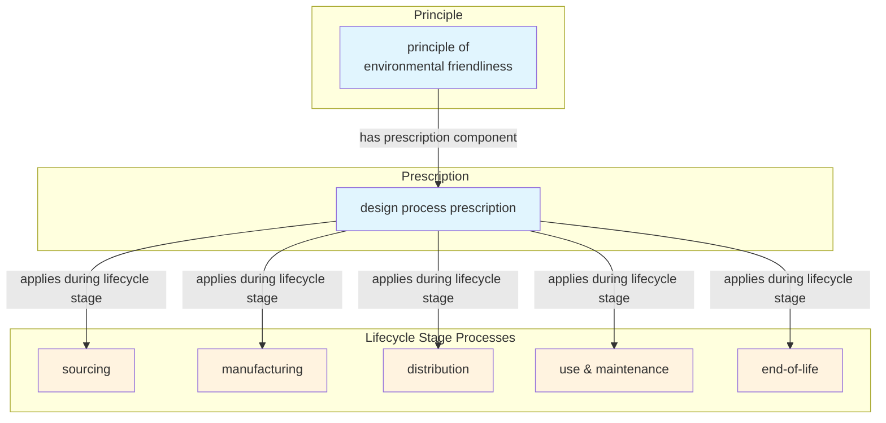

# GDPO Design Patterns

Version: 4.0.3  
Last Updated: 2026-01-17

This document describes the key design patterns used in GDPO, with Mermaid diagrams illustrating the relationships between classes and properties.

---

## Table of Contents

1. [Prescription Component Pattern](#1-prescription-component-pattern)
2. [Evaluation Record Pattern](#2-evaluation-record-pattern)
3. [Reified Score Pattern](#3-reified-score-pattern)
4. [Temporal Region Indexing Pattern](#4-temporal-region-indexing-pattern-v402)
5. [Aims-At Pattern](#5-aims-at-pattern-v402)
6. [Process–Record Linkage Pattern](#6-processrecord-linkage-pattern)
7. [Honesty Evaluation Patterns](#7-honesty-evaluation-patterns)
8. [Lifecycle Stage Pattern](#8-lifecycle-stage-pattern)

---

## 1. Prescription Component Pattern

Principles prescribe processes via reified prescription components, enabling temporal and conditional qualifiers.



**Example:**
```turtle
gdpo:GDPO0000067  # principle of usefulness statement
    gdpo:GDPO0000062 gdpo:GDPO0000077 .  # has prescription component

gdpo:GDPO0000077  # usefulness prescription
    cco:ont00001942 gdpo:GDPO0000015 ;   # prescribes: design use process
    gdpo:GDPO0000063 gdpo:GDPO0000039 .  # applies during: use and maintenance
```

**When to use:** When you need to specify what processes a principle prescribes and under what conditions (lifecycle stage, temporal scope).

---

## 2. Evaluation Record Pattern

Evaluation records capture assessments with full provenance linking artifact, principle(s), method, and temporal context.



**Necessary conditions (equivalentClass):**
- `is about evaluated artifact` some `material entity`
- `against principle` some `design principle`
- `assessed during temporal region` some `temporal region`

---

## 3. Reified Score Pattern

For multi-criterion evaluations, scores are reified as separate entities with principle and scale context.



**When to use:** When evaluating against multiple principles or using multiple scoring scales. Prefer this over multiple `has score` literals directly on the record.

**Legacy shortcut:** For single-criterion evaluations, `has score` (xsd:decimal) directly on the record is acceptable.

---

## 4. Temporal Region Indexing Pattern (v4.0.3)

GDPO v4.0.3 introduces BFO 2020–compliant temporal indexing using temporal regions instead of (or in addition to) xsd:dateTime literals.



**Properties:**

| Property | Domain | Range | Use |
|----------|--------|-------|-----|
| `assessed during temporal region` (GDPO0000468) | evaluation record | BFO:temporal region | When evaluation occurred |
| `applies during temporal region` (GDPO0000467) | process prescription | BFO:temporal region | When prescription applies |
| `assessed_on` (GDPO0000050) | evaluation record | xsd:dateTime | Legacy timestamp |

**When to use temporal regions:**
- Integration with time ontologies (OWL-Time)
- Interval-based reasoning (periods, not instants)
- Full BFO 2020 compliance

**When legacy xsd:dateTime is acceptable:**
- Lightweight timestamping
- Point-in-time records
- Systems not requiring temporal region modeling

---

## 5. Aims-At Pattern (v4.0.3)

Principles aim at artifact-side targets (qualities, functions, dispositions) using OWL2 punning.



**Implementation notes:**
- Target values are punned individuals (classes treated as individuals)
- OWL range restrictions intentionally omitted (v4.0.3) to avoid treating targets as instances of BFO categories
- Validate via SHACL: target must be an IRI and a subclass of quality/function/disposition

**SHACL validation:**
```turtle
gdpo-shapes:AimsAtTargetShape a sh:NodeShape ;
    sh:targetSubjectsOf gdpo:GDPO0000454 ;
    sh:property [
        sh:path gdpo:GDPO0000454 ;
        sh:nodeKind sh:IRI ;
        sh:message "Target must be an IRI (punned class)"
    ] .
```

---

## 6. Process–Record Linkage Pattern

Evaluation processes produce evaluation records, establishing truthmaker provenance.



**Truthmaker grounding:** The evaluation record's assertions are grounded in:
1. The evaluation process that produced it
2. The outcome-bearing configuration measured during that process

---

## 7. Honesty Evaluation Patterns

GDPO distinguishes interaction honesty (artifact-borne) from communicative honesty (claims/marketing).

### 7a. Interaction Honesty Evaluation



**Use for:** Evaluating whether controls, affordances, and perceptible cues align with actual functions.

### 7b. Communicative Honesty Evaluation



**Use for:** Evaluating whether manuals, labels, or advertisements truthfully represent the artifact.

**Communication content subclasses:**
- `product manual content` (GDPO0000447)
- `product label content` (GDPO0000448)
- `product advertisement content` (GDPO0000449)

---

## 8. Lifecycle Stage Pattern

Environmental friendliness and other lifecycle-dependent principles use lifecycle stage processes.



**Lifecycle stage classes:**
| Class | Description |
|-------|-------------|
| `design sourcing process` | Material/component acquisition |
| `design manufacturing process` | Artifact production |
| `design distribution process` | Delivery to end users |
| `design use and maintenance process` | Normal operation and upkeep |
| `design end-of-life handling process` | Disposal, recycling, reuse |

---

## Color Legend

| Color | Meaning |
|-------|---------|
| Blue (#e1f5fe) | Information Content Entities (ICE) |
| Orange (#fff3e0) | Processes (Occurrents) |
| Green (#e8f5e9) | Evaluation Records |
| Pink (#fce4ec) | Material Entities / Agents |
| Purple (#f3e5f5) | Temporal Regions |
| Yellow (#fff8e1) | Score Components |
| Gray (#eeeeee) | Legacy / Deprecated |

---

## Version History

| Version | Patterns Added/Changed |
|---------|------------------------|
| v1.4.7 | Evaluation Record Pattern |
| v1.5.1 | Lifecycle Stage Pattern |
| v3.0.0 | Prescription Component Pattern |
| v4.0.0 | Reified Score Pattern, Honesty Evaluation Patterns, Process–Record Linkage |
| v4.0.3 | Temporal Region Indexing Pattern, Aims-At Pattern (range removal) |
