# GDPO Design Pattern Diagrams

Mermaid diagrams illustrating the ontological design patterns that answer each competency question.

---

## CQ1: Which design processes does the principle of innovativeness prescribe?

**Pattern:** Principle → Prescription Component → Process

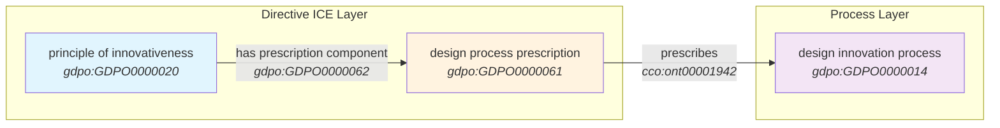

---

## CQ2: Which principle of good design prescribes a design use process?

**Pattern:** Reverse lookup from Process → Prescription → Principle

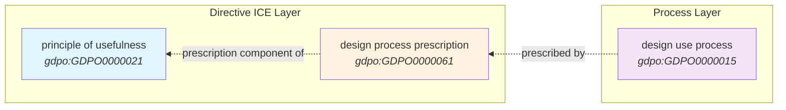

---

## CQ3: Which design evaluation methods operationalize the principle of minimalism?

**Pattern:** Method → operationalizes → Principle

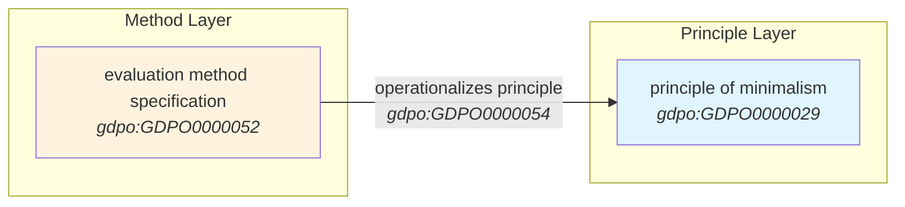

---

## CQ4: Which design principles apply to a given design lifecycle process?

**Pattern:** Principle → Prescription → applies during → Lifecycle Stage

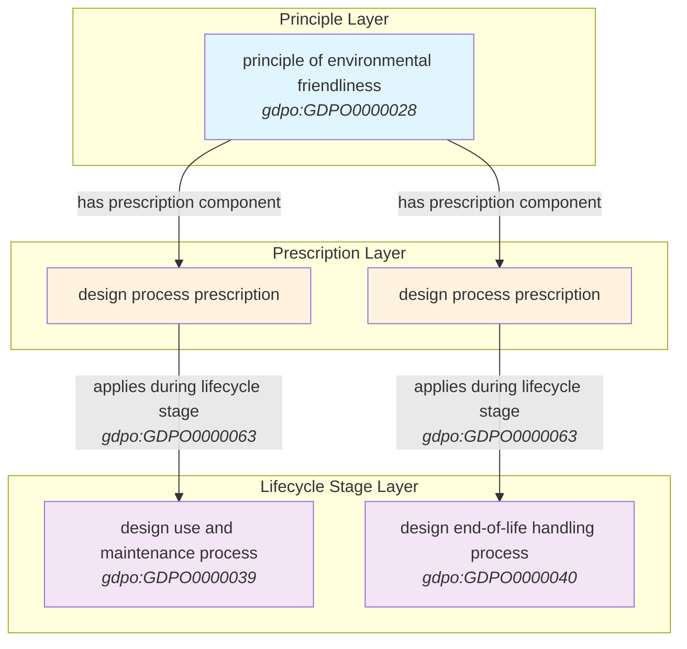

---

## CQ5: Which qualities or dispositions are linked to a specific design principle?

**Pattern:** Principle ←is about→ Quality/Disposition (via equivalent class)

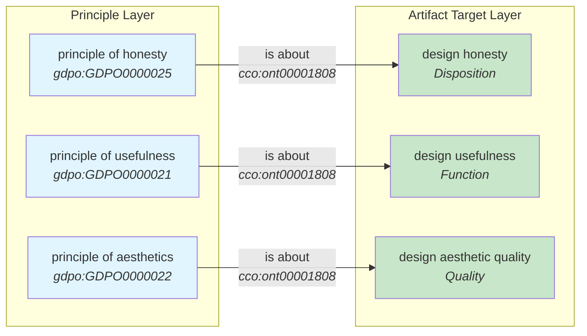

---

## CQ6 & CQ7: What artifacts have been evaluated, and against which principles?

**Pattern:** Evaluation Record → Artifact + Principle

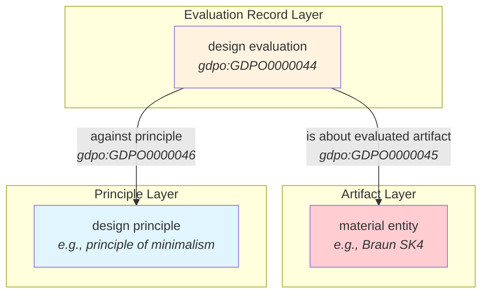

---

## CQ8 & CQ9 & CQ10: Evaluation details (method, score, date)

**Pattern:** Evaluation Record with Method, Score, and Timestamp

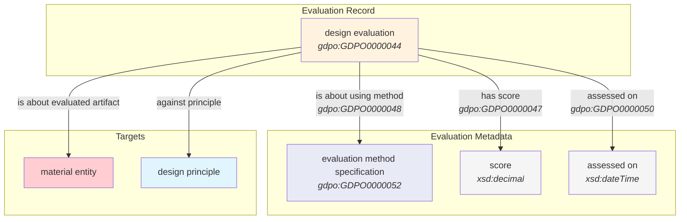

---

## CQ11 & CQ12: Evaluation method prescribes process, operationalizes principle

**Pattern:** Method ↔ Process ↔ Principle

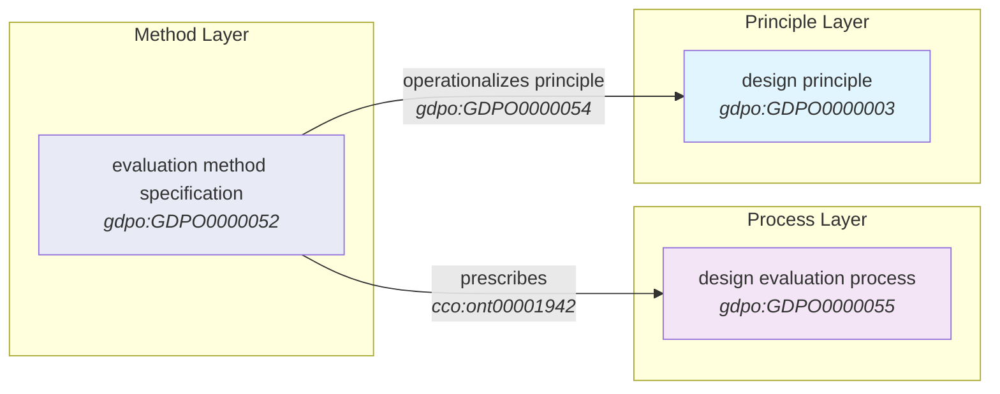

---

## CQ15: Which qualities inhere in a given artifact?

**Pattern:** Quality → inheres in → Material Entity

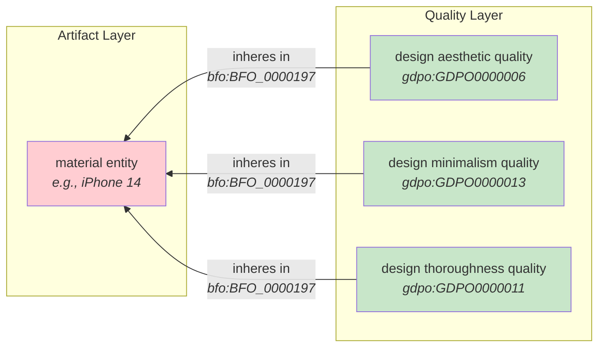

---

## CQ16: Which dispositions are realized in which processes?

**Pattern:** Disposition → realized in → Process

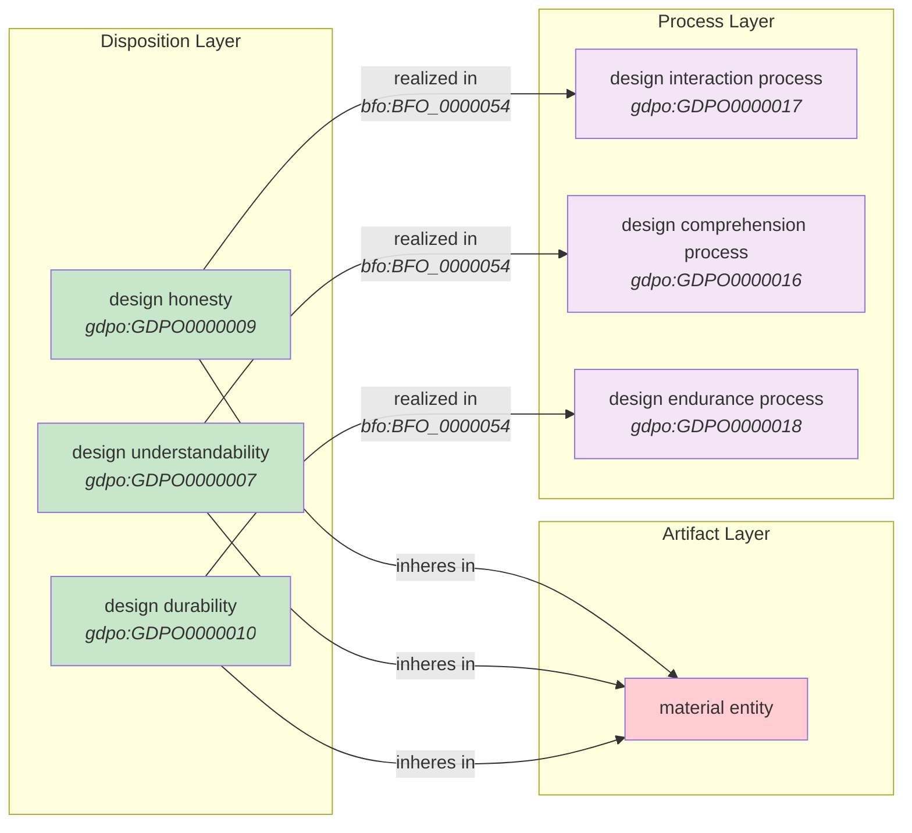

---

## CQ17: Which aspects of honesty does an artifact exhibit?

**Pattern:** Honesty Facets with Basis and Realization

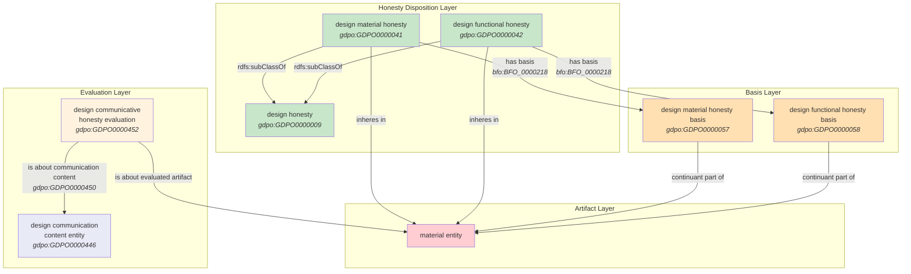

---

## CQ18: Which principles are part of the Rams ten principles specification?

**Pattern:** Specification → has principle component → Principle Statements

```mermaid
graph TB
    subgraph "Specification Layer"
        RTS[rams ten principles specification 001<br/><i>gdpo:GDPO0000065</i>]
    end
    
    subgraph "Principle Statement Individuals"
        P1[principle of innovativeness 001<br/><i>gdpo:GDPO0000066</i>]
        P2[principle of usefulness 001<br/><i>gdpo:GDPO0000067</i>]
        P3[principle of aesthetics 001<br/><i>gdpo:GDPO0000068</i>]
        P4[principle of understandability 001<br/><i>gdpo:GDPO0000069</i>]
        P5[principle of unobtrusiveness 001<br/><i>gdpo:GDPO0000070</i>]
        P6[principle of honesty 001<br/><i>gdpo:GDPO0000071</i>]
        P7[principle of durability 001<br/><i>gdpo:GDPO0000072</i>]
        P8[principle of thoroughness 001<br/><i>gdpo:GDPO0000073</i>]
        P9[principle of env. friendliness 001<br/><i>gdpo:GDPO0000074</i>]
        P10[principle of minimalism 001<br/><i>gdpo:GDPO0000075</i>]
    end
    
    RTS -->|has principle component<br/><i>gdpo:GDPO0000060</i>| P1
    RTS -->|has principle component| P2
    RTS -->|has principle component| P3
    RTS -->|has principle component| P4
    RTS -->|has principle component| P5
    RTS -->|has principle component| P6
    RTS -->|has principle component| P7
    RTS -->|has principle component| P8
    RTS -->|has principle component| P9
    RTS -->|has principle component| P10
    
    style RTS fill:#bbdefb
    style P1 fill:#e1f5fe
    style P2 fill:#e1f5fe
    style P3 fill:#e1f5fe
    style P4 fill:#e1f5fe
    style P5 fill:#e1f5fe
    style P6 fill:#e1f5fe
    style P7 fill:#e1f5fe
    style P8 fill:#e1f5fe
    style P9 fill:#e1f5fe
    style P10 fill:#e1f5fe
```

---

## CQ19: How does the ontology distinguish qualities from principles?

**Pattern:** Principle (Directive ICE) ↔ Quality/Disposition/Function (BFO Continuant)

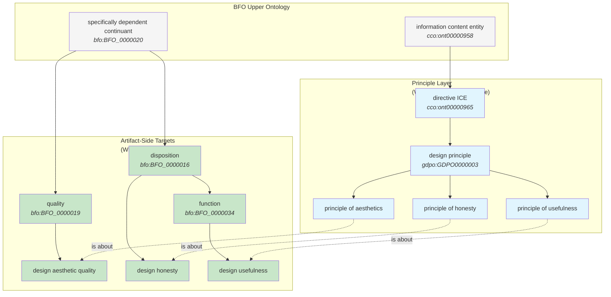

---

## CQ20: Which agents carried out a design evaluation process?

**Pattern:** Process → has participant → Agent; Process → has output → Evaluation Record

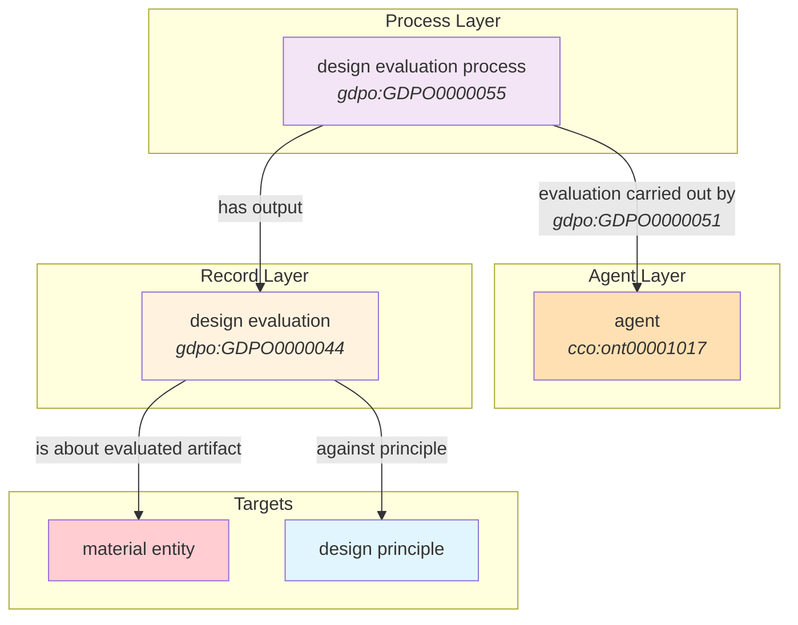

---

## Legend

| Color | Meaning |
|-------|---------|
| 🔵 Light Blue | Directive ICE / Principle |
| 🟢 Light Green | Quality / Disposition / Function |
| 🟣 Light Purple | Process |
| 🟠 Light Orange | Basis / Agent |
| 🟡 Cream | Evaluation / Method |
| 🔴 Light Red | Material Entity (Artifact) |

---

## Complete Architecture Overview

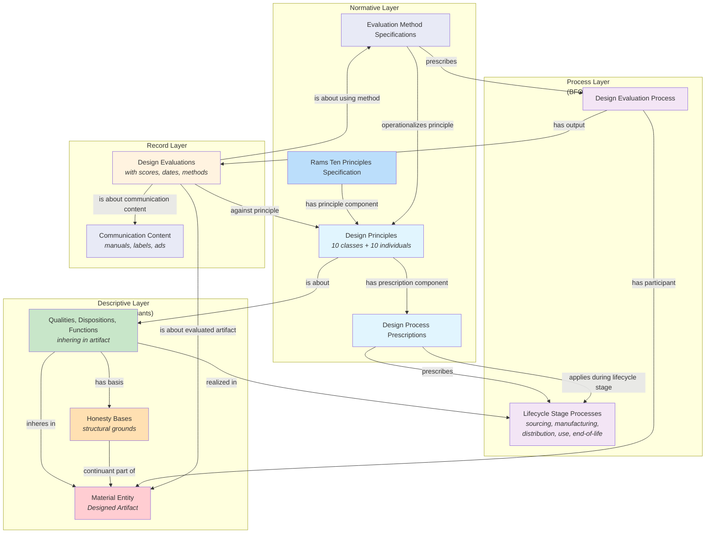
